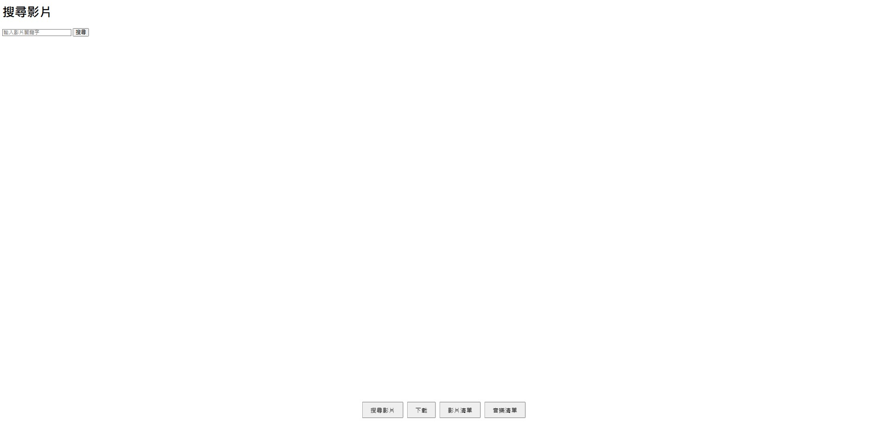
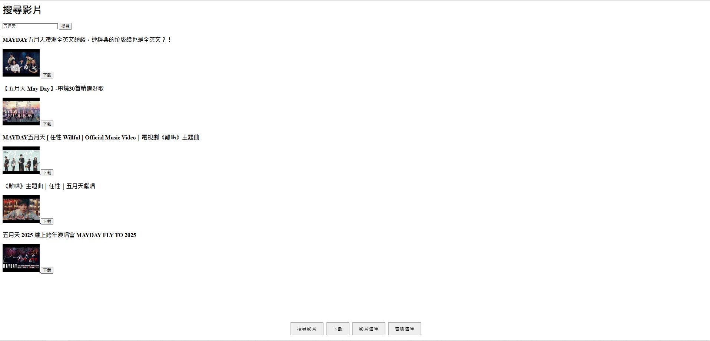
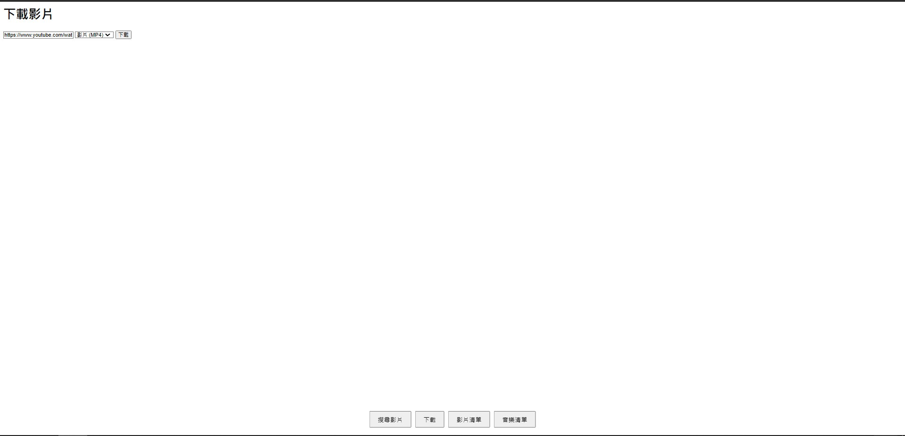
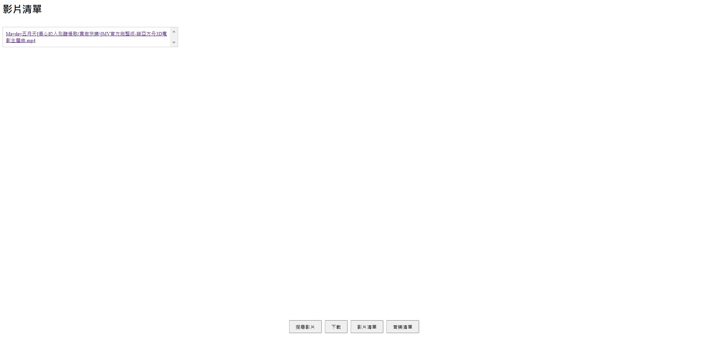
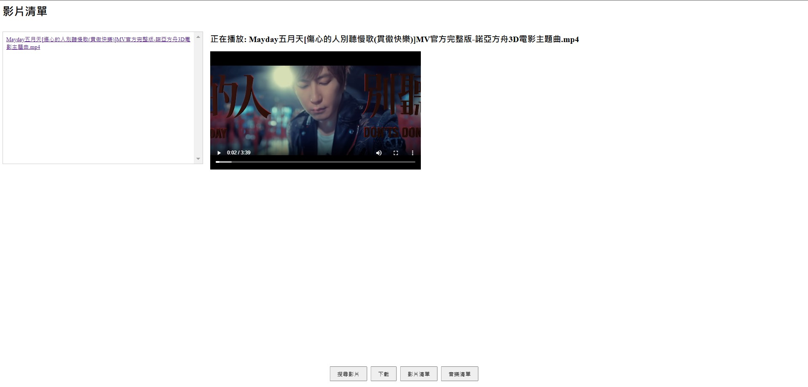
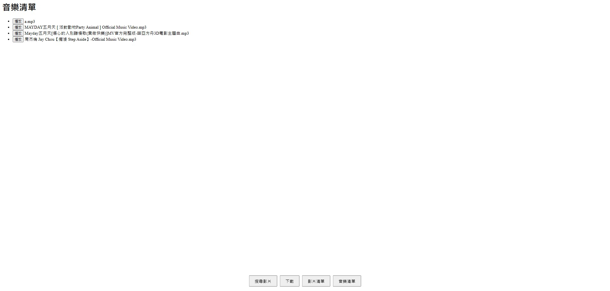

# **YouTube 下載與播放平台**

## **專案簡介**
本專案是一個使用 **Java** 開發的 **網頁伺服器**，提供用戶搜尋 **YouTube** 影片並下載成 **影片檔** 或 **音樂檔**。此外，該平台還支援播放已下載的影片與音樂，提供流暢的使用體驗。

## **主要功能**
1. **YouTube 影片搜尋**  
   - 透過 **YouTube API** 搜尋影片資訊（需要提供自己的 YouTube API）。  
   - 用戶可輸入關鍵字，獲取相關影片結果。  
   
2. **影片與音樂下載**  
   - 透過 **YouTube 影片名稱** 下載 **MP4（影片）** 或 **MP3（音樂）**。  

3. **內建播放器**  
   - 直接在 **網頁上播放** 已下載的影片與音樂。  
   - 提供播放控制（播放、暫停、調整音量等）。  

4. **簡易後端架構**  
   - 使用 **Java** 開發後端，實現 API 請求處理與檔案管理。  
   - 提供 **HTTP API** 供前端調用，以完成搜尋、下載與播放功能。  

---

## **技術棧**
- **後端**：Java  
- **前端**：HTML / CSS / JavaScript  
- **API 整合**：YouTube API、FFmpeg（轉換音樂格式）  
- **伺服器**：本機  

---

## **使用方式**
### **1. 設置 YouTube API**
- 下載並解壓縮專案後，打開 `youtube_api.txt`，將你的 YouTube API Key 貼入檔案內並儲存。  

### **2. 啟動伺服器**
- 點選 `SimpleHttpServer.bat`，系統將以 **CMD** 開啟伺服器。  
- 在 CMD 視窗中，將顯示一個網址，請使用瀏覽器開啟該網址進入系統。  

### **3. 搜尋影片**
- 在輸入框內輸入關鍵字，點擊「搜尋」按鈕，系統會顯示搜尋結果。  
  


### **4. 選擇下載格式**
- 在搜尋結果中，選擇你要下載的影片，並按下下載。
- 會跳轉到下載畫面中，選擇 **MP4（影片）** 或 **MP3（音樂）**。
  
  

### **5. 開始下載**
- 點擊「下載」按鈕，系統將自動處理並下載檔案。  
 

### **6. 播放已下載內容**
- 進入「影片清單」或「音樂清單」頁面，點選已下載的影片或音樂，即可使用內建播放器觀看或收聽。 
    
影片清單畫面
 


音樂清單畫面

---

## **專案目錄與檔案說明**
```plaintext
/網頁版下載撥放音樂影片
│── /music                      # 放置下載後音樂的地方
│── /Video                      # 放置下載後影片的地方
│── DownloadHandler.java        # 下載畫面
│── DownloadsListHandler.java   # 影片清單畫面
│── DownloadUtils.java          # 下載功能
│── gson-2.11.0.jar             # 能夠方便地將 Java 對象與 JSON 之間進行轉換的套件
│── jackson-databind-2.18.2.jar # 將 Java 對象與 JSON 進行轉換的套件
│── jl1.0.jar                   # 用於 Java 音頻處理的套件
│── MP3_Stream.java             # 這是想做客戶端撥放音樂所做的測試檔案
│── MP3Client.bat               # 這是執行MP3_Stream的檔案
|── MP3Client.java              # 這是想做客戶端撥放音樂所做的測試檔案
|── MusicListHandler.java       # 音樂清單畫面
|── MusicPlayHandler.java       # 音樂撥放功能
|── SearchHandler.java          # 搜尋畫面
|── SimpleHttpServer.java       # 伺服器建構
│── youtube_api.txt             # YouTube API Key 配置檔案
│── SimpleHttpServer.bat        # 伺服器啟動腳本
/images                         # 文件中使用的圖片（如說明文件示例圖）
README.md                       # 使用說明文件（本文件）
